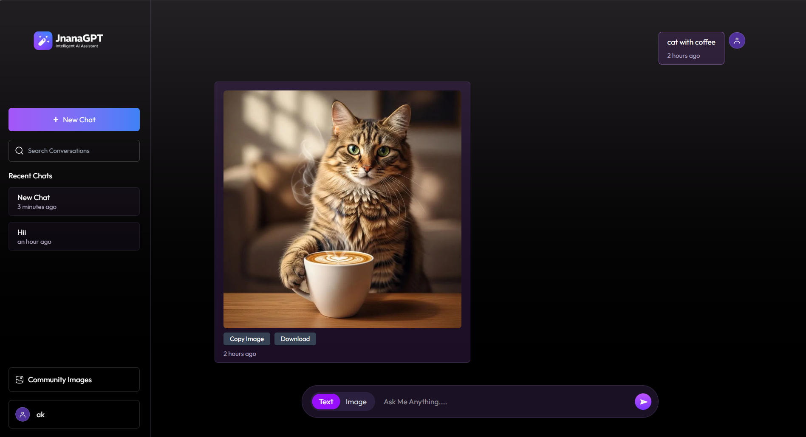

# 🚀 JnanaGPT - AI Chat Application

An AI-powered chat application that supports **text generation, image generation, and community sharing**, built using modern web technologies.

---

## 📸 Screenshots

### 💬 Chat Interface

### 🖼️ Image Generation

---

## ✨ Features

- 💬 AI Chat using Gemini API  
- 🖼️ Image Generation  
- 📥 Download & Copy Images  
- 🌐 Community Image Sharing  
- 🔐 User Authentication (Login/Register)  
- ⚡ Real-time Chat Experience  
- 🎨 Modern UI (React + Tailwind)

---

## 🛠️ Tech Stack

### Frontend
- React.js
- Tailwind CSS
- Axios

### Backend
- Node.js
- Express.js
- MongoDB

### APIs & Tools
- Gemini API (Google AI)
- ImageKit (Image Hosting)

---

## 📂 Project Structure
# 🚀 JnanaGPT - AI Chat Application

An AI-powered chat application that supports **text generation, image generation, and community sharing**, built using modern web technologies.

---

## ✨ Features

- 💬 AI Chat using Gemini API  
- 🖼️ Image Generation  
- 📥 Download & Copy Images  
- 🌐 Community Image Sharing  
- 🔐 User Authentication (Login/Register)  
- ⚡ Real-time Chat Experience  
- 🎨 Modern UI (React + Tailwind)

---

## 🛠️ Tech Stack

### Frontend
- React.js
- Tailwind CSS
- Axios

### Backend
- Node.js
- Express.js
- MongoDB

### APIs & Tools
- Gemini API (Google AI)
- ImageKit (Image Hosting)

---

## 📂 Project Structure
- JnanaGPT/
- │
- ├── frontend/ # React App
- ├── backend/ # Node.js Server
- ├── README.md

---

## ⚙️ Installation & Setup

### 1️⃣ Clone the repository

- git clone https://github.com/your-username/JnanaGPT.git
- cd JnanaGPT

## 2️⃣ Setup Backend
- cd backend
- npm install

- Create .env file:

- GEMINI_API_KEY=your_api_key
- IMAGEKIT_URL_ENDPOINT=your_url
- IMAGEKIT_PUBLIC_KEY=your_key
- IMAGEKIT_PRIVATE_KEY=your_key
- MONGO_URI=your_mongodb_uri
- JWT_SECRET=your_secret

- Run backend:
- npm run server

# 3️⃣ Setup Frontend

- cd frontend
- npm install
- npm run dev

🚀 Future Improvements

🔄 Streaming AI responses

❤️ Like system for images

💬 Comments on images

📱 Mobile optimization

⭐ Show your support

Give a ⭐ if you like this project!